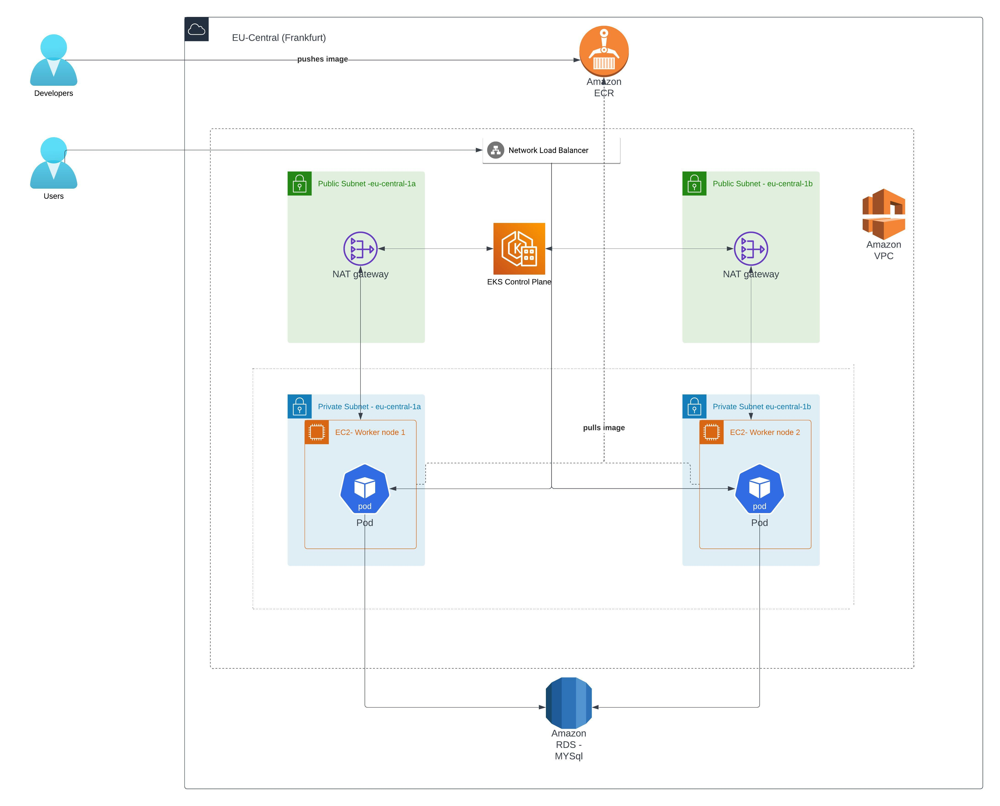
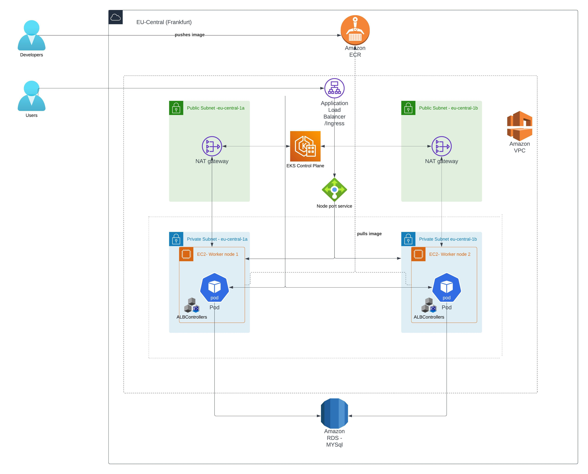

# Create EKS Cluster & Node Groups


## Step-00: Introduction & Pre-requisites
- Install/Setup pre-requisites
  - AWS Account with IAM user
  - AWS Cli installation **aws --version**  
  - eksctl installation **eksctl version**
  - kubectl **kubectl version**
- aws configure


## Step-01: Create EKS Cluster using eksctl
> It will take 10 to 15 minutes to create the Cluster Control Plane


Template: 
```
# Create Cluster
eksctl create cluster --name=eksdemo-mathema \
                      --region=eu-central-1 \
                      --zones=eu-central-1a,eu-central-1b \
                      --without-nodegroup 

# Get List of clusters
eksctl get cluster                  
```
**Output:**
- VPC
  - Public & Private Subnets
  - Internet gateway
  - NAT Gateway
  - Route tables
  - Subnets
  - Security Groups
- EKS Control plane
- IAM Roles & Policies


## Step-02: Create & Associate IAM OIDC Provider for our EKS Cluster
- To enable and use AWS IAM roles for Kubernetes service accounts on our EKS cluster, we must create &  associate OIDC identity provider.

```                   
# Template
eksctl utils associate-iam-oidc-provider \
    --region region-code \
    --cluster <cluter-name> \
    --approve

# Replace with region & cluster name
eksctl utils associate-iam-oidc-provider \
    --region us-east-1 \
    --cluster eksdemo1 \
    --approve
```


## Step-03: Create EC2 Keypair
- Create a new EC2 Keypair with name as `eks-mathema-keypair`
- This keypair we will use it when creating the EKS NodeGroup.
- This will help us to login to the EKS Worker Nodes using Terminal (if public instances).

## Step-04: Create Node Group with additional Add-Ons in Public Subnets
- These add-ons will create the respective IAM policies for us automatically within our Node Group role.


 ```
# Create Public Node Group   
eksctl create nodegroup --cluster=eksdemo1 \
                        --region=us-east-1 \
                        --name=eksdemo1-ng-private1 \
                        --node-type=t3.medium \
                        --nodes=2 \
                        --nodes-min=2 \
                        --nodes-max=4 \
                        --node-volume-size=20 \
                        --ssh-access \
                        --ssh-public-key=eks-mathema-keypair \
                        --managed \
                        --asg-access \
                        --external-dns-access \
                        --full-ecr-access \
                        --appmesh-access \
                        --alb-ingress-access \
                        --node-private-networking
```

**Output:**
- Managed Node group
  - EC2 instances
  - Auto scaling
- IAM Roles & Policies

## Step-05: Verify Cluster & Nodes

### List Worker Nodes
```
# List EKS clusters
eksctl get cluster

# List NodeGroups in a cluster
eksctl get nodegroup --cluster=eksdemo-mathema

# List Nodes in current kubernetes cluster
kubectl get nodes -o wide

# Our kubectl context should be automatically changed to new cluster
kubectl config view --minify
```

## Step-06: Install ALB Controller (OPTIONAL)

**this step is to enable the kubernetes cluster to enable using ingress via Application load balancers**

**Ingress is the most useful if you want to expose multiple services under the same IP address, and these services all use the same L7 protocol (typically HTTP). You only pay for one load balancer and you can get a lot of features out of the box (like SSL, Auth, Routing, etc)**


- Download Latest IAM policy document
curl -oiam_policy_latest.json https://raw.githubusercontent.com/kubernetes-sigs/aws-load-balancer-controller/main/docs/install/iam_policy.json

- Create IAM Policy using downloaded document 
aws iam create-policy --policy-name AWSLoadBalancerControllerIAMPolicy  --policy-document file://iam_policy_latest.json

  Output:
```
  {
    "Policy": {
        "PolicyName": "AWSLoadBalancerControllerIAMPolicy",
        "PolicyId": "ANPATVBHQTCIIZNBJCHQE",
        "Arn": "<arn>",
        "Path": "/",
        "DefaultVersionId": "v1",
        "AttachmentCount": 0,
        "PermissionsBoundaryUsageCount": 0,
        "IsAttachable": true,
        "CreateDate": "2023-05-01T10:54:56+00:00",
        "UpdateDate": "2023-05-01T10:54:56+00:00"
    }
}
```
- Create IAM Service account using the policy

eksctl create iamserviceaccount --cluster=<cluster-name> --namespace=kube-system --name=aws-load-balancer-controller  --attach-policy-arn=*<arn from above output>** --override-existing-serviceaccounts --approve


- Create ALB Controller using HELM

  - **Pre-requisite- Install helm locally** 
     - choco install kubernetes-helm
     - helm repo add eks https://aws.github.io/eks-charts
     - helm repo update
  - **Create Controller**

helm install aws-load-balancer-controller eks/aws-load-balancer-controller  -n kube-system --set clusterName=*<cluster-name>**  **--set serviceAccount.create=false --set serviceAccount.name=aws-load-balancer-controller** --set region=**<region code>** --set vpcId=**<vpc-id from create cluster>** --set image.repository=602401143452.dkr.ecr.eu-central-1.amazonaws.com/amazon/aws-load-balancer-controller


Output:
```
NAME: aws-load-balancer-controller
LAST DEPLOYED: Mon May  1 13:09:19 2023
NAMESPACE: kube-system
STATUS: deployed
REVISION: 1
TEST SUITE: None
NOTES:
AWS Load Balancer controller installed!
```

kubectl get deployment -n kube-system aws-load-balancer-controller

- Create Ingress Class

Navigate to the kuberentes artefacts folder and run the following command:

kubectl apply -f 01-ingressclass-resource.yaml


## Step-07: Prepare and push docker image
- Build application jar
mvn clean install -DskipTests=true

- Build docker image
docker build -t mathema-eks-demo .

- Docker login with ECR
first create a ECR repository .Navigate to the ECR repository and get the path and then  perform docker login:

          aws ecr get-login-password --region eu-central-1 | docker login --username AWS --password-stdin <customer id>.dkr.ecr<region>.amazonaws.com/<ecr repo>


- Docker tag and push

       docker tag mathema-eks-demo:latest <customer id>.dkr.ecr<region>.amazonaws.com/<ecr repo>:latest
       docker push <customer id>.dkr.ecr<region>.amazonaws.com/<ecr repo>:latest

## Step-08: Install Kuberentes Artefacts


Navigate to the kuberentes artefacts folder and run the following command:

kubectl apply -f secrets.yaml

kubectl apply -f deployment.yaml

kubectl apply -f loadbalancer-service.yaml




kubectl apply -f nodeport-service.yaml

kubectl apply -f ingress.yaml




**List Artefacts**:

kubectl get deployments

kubectl get pods

kubectl get svc

kubectl get ingress

## Step-09: Container Insights

- Assigning CloudWatchAgentServerPolicy Policy

On AWS Console ,Go to Services -> EC2 -> Worker Node EC2 Instance -> IAM Role -> Click on that role
Associate Policy: CloudWatchAgentServerPolicy

-  Download and edit container insights resource creator

    https://raw.githubusercontent.com/aws-samples/amazon-cloudwatch-container-insights/latest/k8s-deployment-manifest-templates/deployment-mode/daemonset/container-insights-monitoring/quickstart/cwagent-fluentd-quickstart.yaml

Replace {{cluster_name}} with your cluster name
Replace {{region_name}} with your region name

- Create Deomon sets 
kubectl apply -f container_insights_fluent_d.yaml

- View insights
Navigate to Cloud watch->container insights


Check resources map, Log groups etc.


## Step-10:Clean up
- Delete load balancer related services
   - kubectl delete service expense-service-api
   - kubectl delete ingress ingress-expense-service

- Delete CloudWatchAgentServerPolicy

    On AWS Console ,Go to Services -> EC2 -> Worker Node EC2 Instance -> IAM Role 
   delete CloudWatchAgentServerPolicy

 **Rollback all manual changes, like changes to Security group, adding new policies etc.**
   
- Delete Node group

  eksctl delete nodegroup --cluster=<cluster name>  --name=<node group name>

- Delete Cluster

  eksctl delete cluster <cluster name>
  

## References
- EkSCTL 
  https://eksctl.io/

- AWS EKS
  https://docs.aws.amazon.com/eks/latest/userguide/getting-started-console.html

- Kubeclt & Kubernetes Cheat sheets
  https://kubernetes.io/docs/reference/kubectl/cheatsheet/

- AWS Load balancer Controllers
  https://kubernetes-sigs.github.io/aws-load-balancer-controller/v2.5/how-it-works/
  
- Udemy course
  https://www.udemy.com/share/103mNs3@EUuofX9N0-C_oZxMpS81ASRlLYuQ5SZRbjvXVb8givr0f_i42BOSpwRrqMicrm0K/